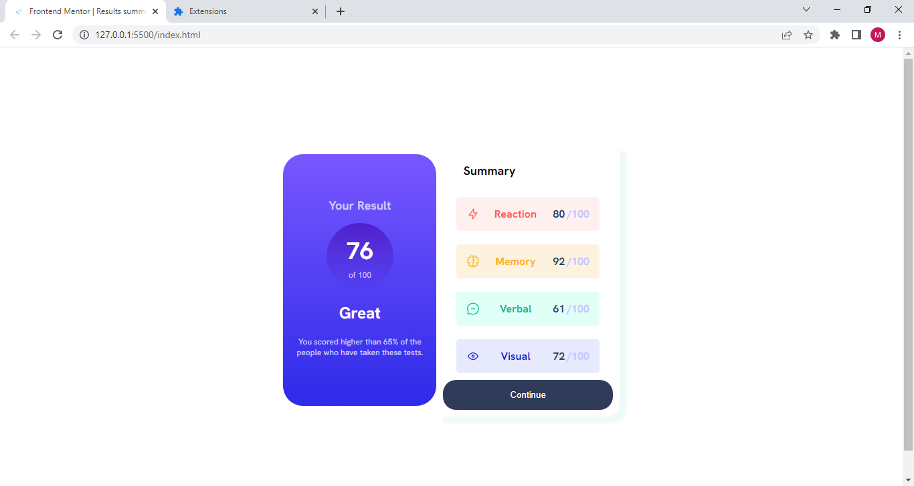

# Frontend Mentor - Results summary component solution

This is a solution to the [Results summary component challenge on Frontend Mentor](https://www.frontendmentor.io/challenges/results-summary-component-CE_K6s0maV). Frontend Mentor challenges help you improve your coding skills by building realistic projects. 

## Table of contents

- [Overview](#overview)
  - [The challenge](#the-challenge)
  - [Screenshot](#screenshot)
  - [Links](#links)
  - [Built with](#built-with)
  - [What I learned](#what-i-learned)
  - [Continued development](#continued-development)
  - [Useful resources](#useful-resources)
- [Author](#author)


## Overview

A solution to the [Results summary component challenge on Frontend Mentor](https://www.frontendmentor.io/challenges/results-summary-component-CE_K6s0maV). 

### The challenge

Users should be able to:

- View the optimal layout for the interface depending on their device's screen size
- See hover and focus states for all interactive elements on the page

### Screenshot



### Links

- Solution URL: [Solution URL](https://www.frontendmentor.io/solutions/results-summary-component-OyjD3RIojQ)
- Live Site URL: [Live site URL](https://mustapha62996.github.io/Result-Summary-Component/)


### Built with

- Semantic HTML5 markup
- CSS custom properties
- Flexbox
- Mobile-first workflow


### What I learned
I learnt how to use the @font-face property effectively.
I have also improved in using Flexbox and Media Queries


```html
<h1>Font face Demo</h1>
```
```css
@font-face{
  font-family: HankenGrotesk-Bold;
  src: url(./assets/fonts/static/HankenGrotesk-Bold.ttf);
}
h1{
  font-family: HankenGrotesk-Bold;
  font-size: 24px;
}
```

### Continued development

I'm going to further improve myself in certain areas in CSS like Media Queries and Flexbox 


### Useful resources

- [W3schools](https://www.w3schools.com/cssref/css3_pr_font-face_rule.php) - This is an amazing article which helped me finally understand the font-face property in CSS. I'd recommend it to anyone still learning this concept.


## Author

- Frontend Mentor - [@Mustapha62996](https://www.frontendmentor.io/profile/Mustapha62996)
- Twitter - [@hassmustapha787](https://www.twitter.com/hassmustapha787)


